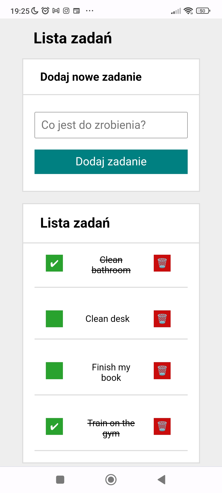

# TODO - LIST

## Demo: https://mr-susel.github.io/todo-list/

## CODE: https://github.com/Mr-SuSeL/todo-list

## App screenshot 

### Describe
That usefull little app can help you with note all of your tasks to do in this particular short period of time.
You can edit tasks, sign it as checked or just delete and create new one.
CSS media querry helps view that app in clear estethic way also on mobile phone screen.

### Page features
- ECMAScript +06 features
- Flexbox and Grid modules
- Simple design
- Source code based on function structure
- Media querry 

